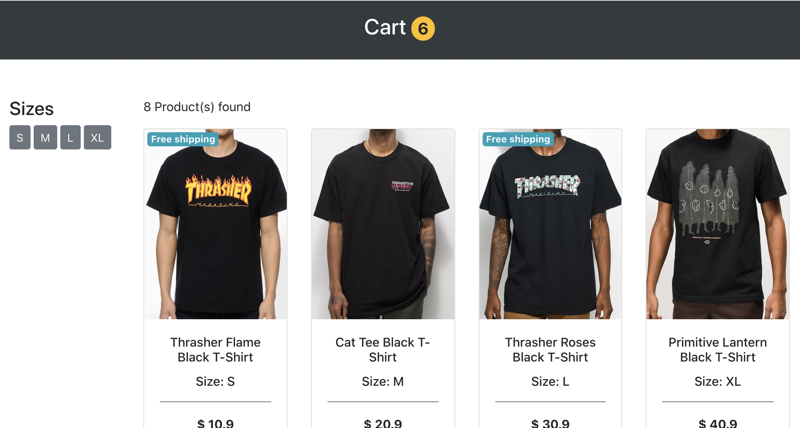
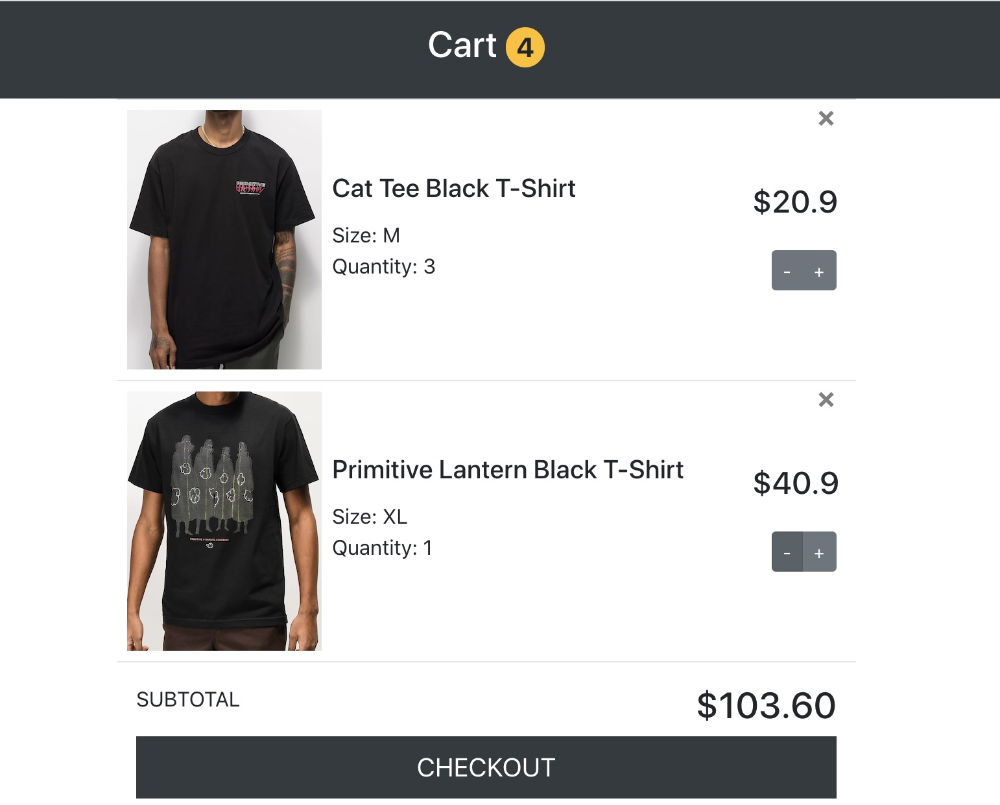

# React Simple Cart

This is a very simple shopping cart powered by React. No state containers such as Redux or router is used in this project. 

We developed this project when learning the fundamentals of React. It demonstrates the power of React. Hope you find it useful.

## Screenshots

### Index page

### Cart page

## Environment

+ React Version:  17.0.1
+ Development Machine: macOS Catalina Version 10.15
+ Development IDE: Visual Studio Code
+ NodeJS: v13.10.1
+ NPM: 6.13.7

### Install

Run `yarn install` to install this project along with its dependencies

### Development

+ Run `yarn start` to start the development server.
+ Open [http://localhost:3000](http://localhost:3000) to view it in the browser.
